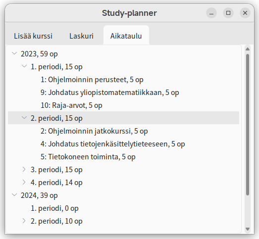

# Study-planner

[](https://codecov.io/gh/TheJiahao/study-planner)

[Uusin release](https://github.com/TheJiahao/ohte-harjoitustyo/releases/tag/loppupalautus)

Sovellus tuottaa aikataulun opinnoille annettujen vaatimusten perusteella.



## Dokumentaatio

- [Käyttöohje](dokumentaatio/kaytto-ohje.md)
- [Vaatimusmäärittely](dokumentaatio/vaatimusmaarittely.md)
- [Arkkitehtuurikuvaus](dokumentaatio/arkkitehtuuri.md)
- [Testausdokumentti](dokumentaatio/testausdokumentti.md)
- [Työaikakirjanpito](dokumentaatio/tyoaikakirjanpito.md)
- [Changelog](dokumentaatio/changelog.md)

## Asennus

1. Asenna Python `3.10.x`.
2. Asenna riippuvuudet:

    ```shell
    poetry install
    ```

3. Käynnistä sovellus:

    ```shell
    poetry run invoke start
    ```

## Invoke-tehtävät

Suorita komennot projektin juurihakemistossa.

### Testaus

```shell
poetry run invoke test
```

### Kattavuusraportti

```shell
poetry run invoke coverage-report
```

### Pylint

```shell
poetry run invoke lint
```

### Koodin formatointi

```shell
poetry run invoke format
```
