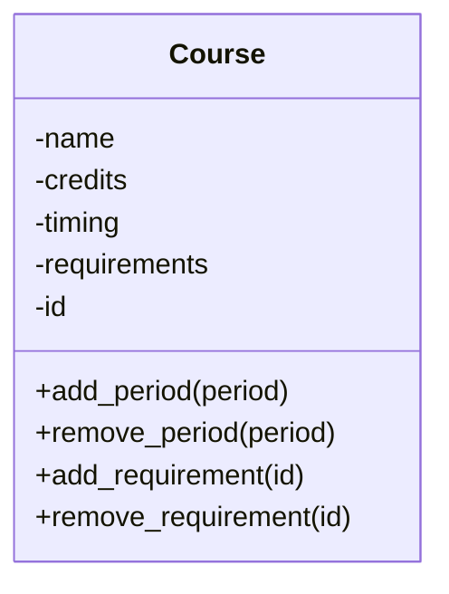

# Arkkitehtuuri

## Sovelluslogiikka

Sovelluksen ainoa oma tietorakenne on `Course`-luokka, joka kuvaa kurssia.

```mermaid
classDiagram
    class Course {
        -name
        -credits
        -timing
        -requirements
        -id
        
        +add_period(period)
        +remove_period(period)
        +add_requirement(id)
        +remove_requirement(id)
    }
```
