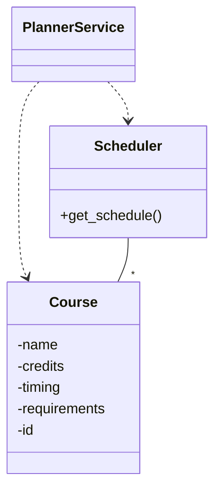
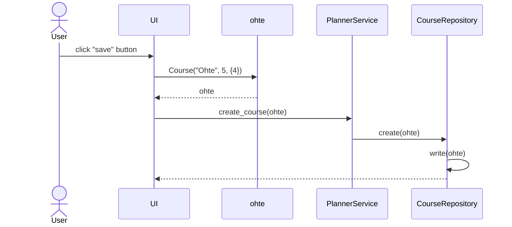
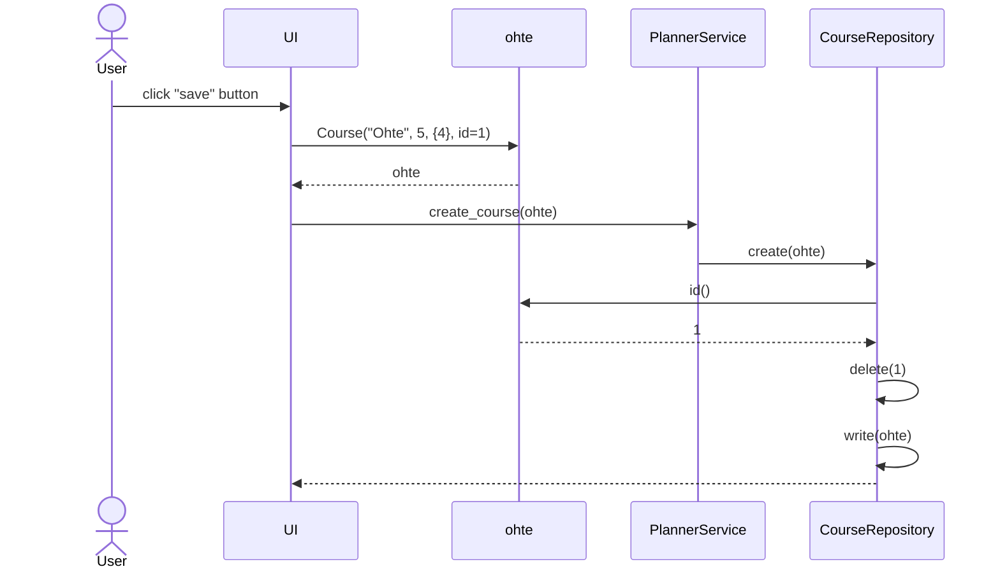
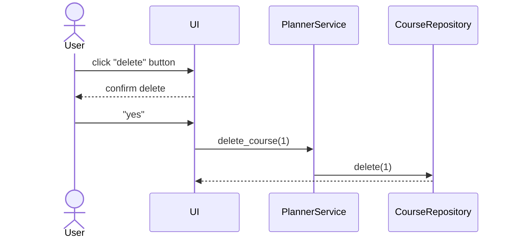
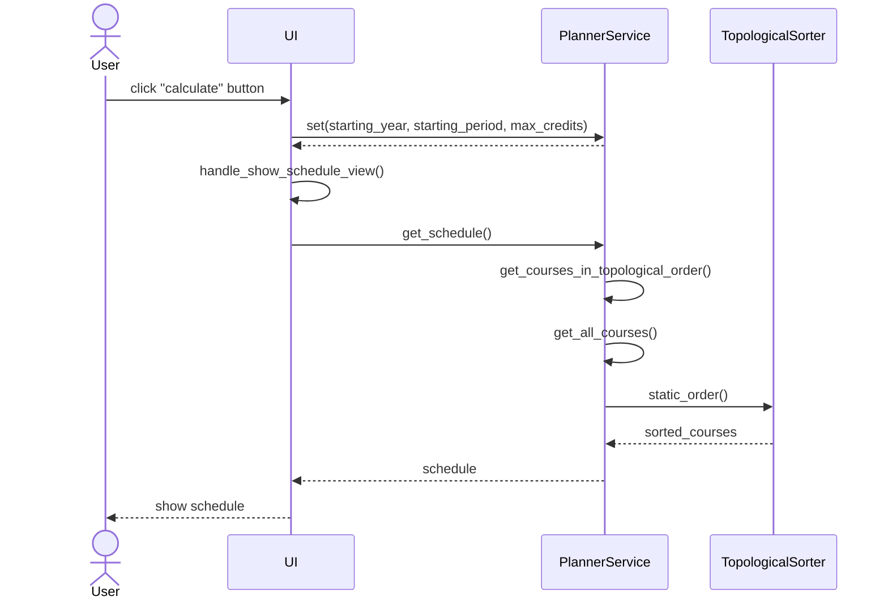

# Arkkitehtuuri

## Sovelluslogiikka

Sovelluksen ainoa oma tietorakenne on `Course`-luokka, joka kuvaa kurssia.
Lisäksi sovelluksessa on aikataulutuksesta vastaava `Scheduler`-luokka ja sovelluslogiikasta vastaava `PlannerService`-luokka.
Luokkien riippuvuudet on esitetty seuraavassa luokkakaaviossa.

## Algoritmi

Sovelluksen toiminta perustuu suunnatun verkon topologiseen järjestykseen  ja Kahnin algoritmiin [^tirakirja][^kahn].

(Tähän tulee algoritmin selitys)

## Toiminnallisuudet

### Uuden kurssin tallentaminen

Oletetaan, että käyttäjä syöttää uuden kurssin "Ohte" tiedot ja painaa Tallenna-nappia.
Tällöin sovelluksen kontrolli etenee seuraavasti:

### Olemassaolevan kurssin muokkaaminen

Oletetaan, että käyttäjä valitsee valikosta olemassaolevan kurssin "Ohte" (id=1), päivittää tietoja sekä painaa Tallenna-nappia.
Tällöin sovelluksen kontrolli etenee seuraavasti:

### Olemassaolevan kurssin poistaminen

Oletetaan, että käyttäjä valitsee valikosta olemassaolevan kurssin "Ohte" (id=1) ja painaa Poista-nappia.
Tällöin sovelluksen kontrolli etenee seuraavasti:

### Aikataulun laskeminen

Oletetaan, että käyttäjä on syöttänyt kurssit ja parametrit aikataulua varten sekä painaa Laske-nappia.
Tällöin sovelluksen kontrolli etenee seuraavasti:

`TopologicalSorter` on standardikirjastoon kuuluvan [graphlib](https://docs.python.org/3/library/graphlib.html)-kirjaston tarjoama.

[^tirakirja]: Antti Laaksonen, *Tietorakenteet ja algoritmit*, 2022. https://www.cs.helsinki.fi/u/ahslaaks/tirakirja/
[^kahn]: Geeksforgeeks, *Kahn’s algorithm for Topological Sorting*. https://www.geeksforgeeks.org/topological-sorting-indegree-based-solution/, luettu 28.4.2023.
