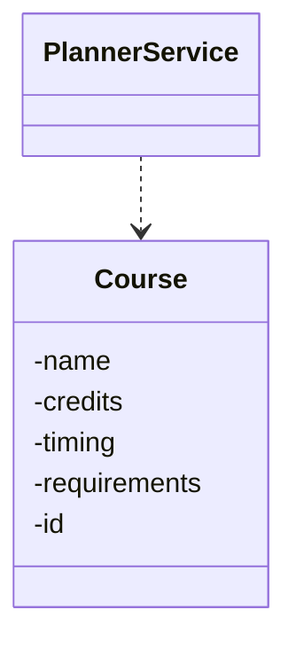
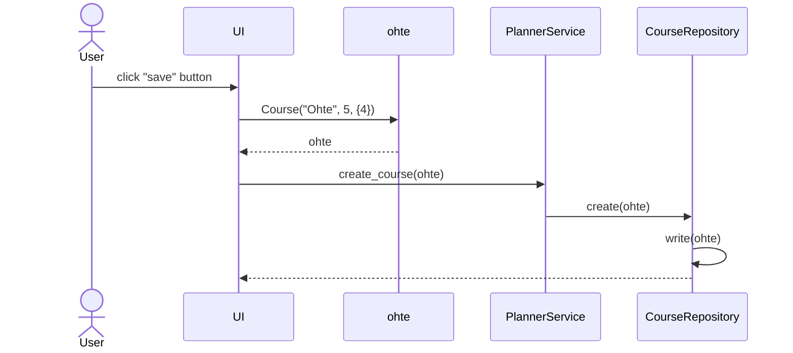
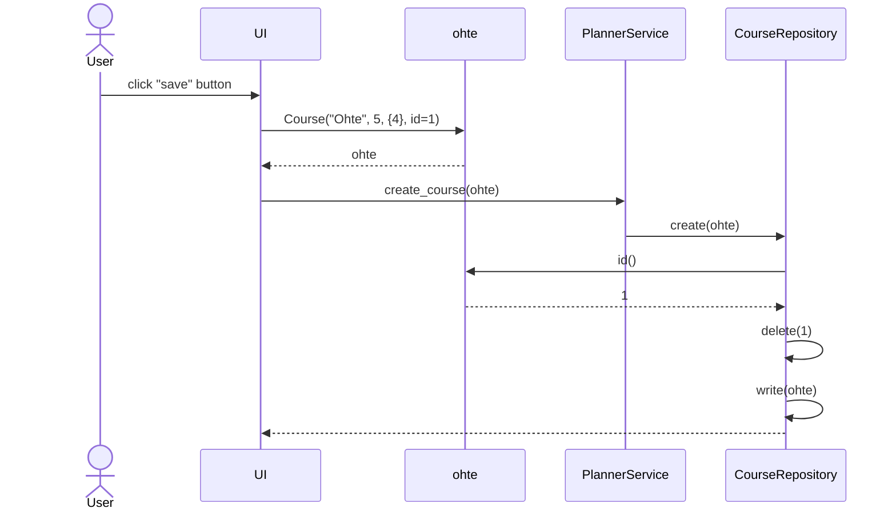
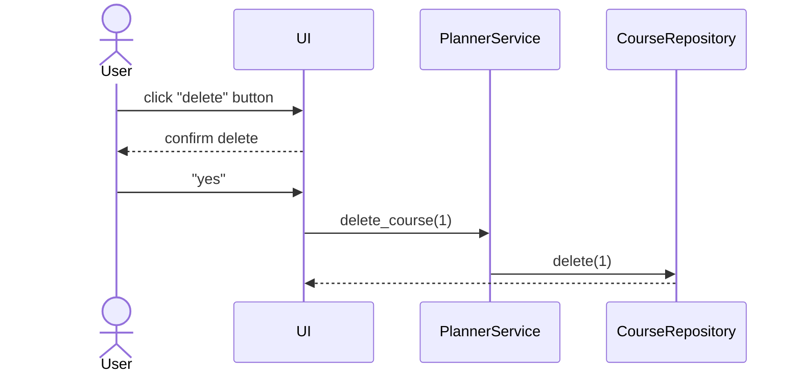
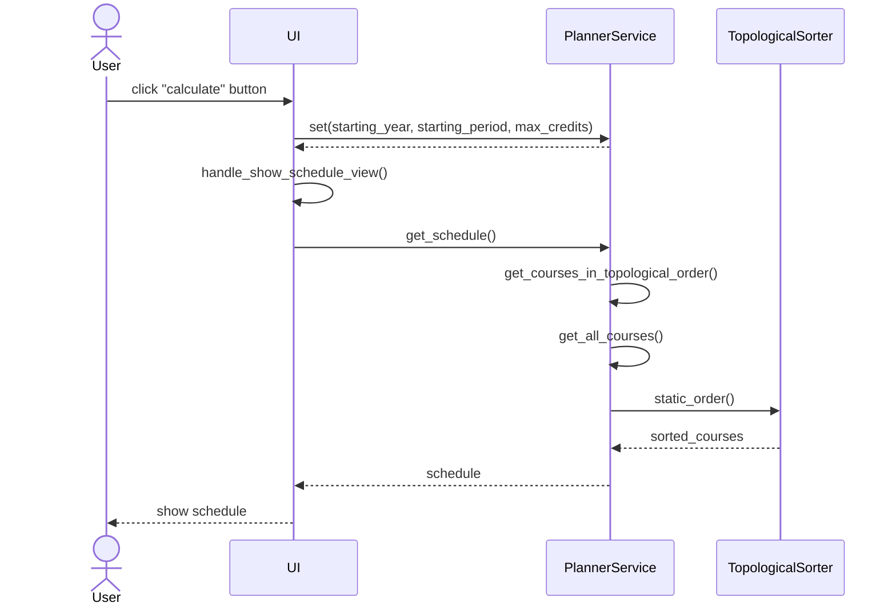

# Arkkitehtuuri

## Sovelluslogiikka

Sovelluksen ainoa oma tietorakenne on `Course`-luokka, joka kuvaa kurssia.



## Algoritmi

Sovelluksen toiminta perustuu suunnatun verkon topologiseen järjestykseen [^tirakirja].
Lisäksi oletetaan, että jos samalla periodilla on tarjolla kurssi ja sen esitietokurssi, niin ne voidaan suorittaa rinnakkain.

Yksinkertaisuuden vuoksi oletetaan, että `result`-taulukossa on valmiiksi jokaista periodia varten tyhjä taulukko.
Lisäksi oletetaan, että jokainen kurssi on tarjolla jollakin periodilla.
Lähtökohtana on lista kursseista topologisessa järjestyksessä, minkä saa [graphlib](https://docs.python.org/3/library/graphlib.html)-kirjaston avulla.
Algoritmin toimintaa on esitetty seuraavassa pseudokoodissa.

```python
courses = get_courses_in_topological_order()
result = []
i = 0

for course in courses:
    total_credits = 0

    while (
        i + starting_period % periods_per_year not in course.timing
        or total_credits > max_credits
    ):
        # Kurssia ei ole tällä periodilla tarjolla, joten seuraavaan periodiin
        total_credits = 0
        i += 1

    total_credits += course.credits

    result[i].append(course)

return result
```

## Toiminnallisuudet

### Uuden kurssin tallentaminen

Oletetaan, että käyttäjä syöttää uuden kurssin "Ohte" tiedot ja painaa Tallenna-nappia.
Tällöin sovelluksen kontrolli etenee seuraavasti:



### Olemassaolevan kurssin muokkaaminen

Oletetaan, että käyttäjä valitsee valikosta olemassaolevan kurssin "Ohte" (id=1), päivittää tietoja sekä painaa Tallenna-nappia.
Tällöin sovelluksen kontrolli etenee seuraavasti:



### Olemassaolevan kurssin poistaminen

Oletetaan, että käyttäjä valitsee valikosta olemassaolevan kurssin "Ohte" (id=1) ja painaa Poista-nappia.
Tällöin sovelluksen kontrolli etenee seuraavasti:



### Aikataulun laskeminen

Oletetaan, että käyttäjä on syöttänyt kurssit ja parametrit aikataulua varten sekä painaa Laske-nappia.
Tällöin sovelluksen kontrolli etenee seuraavasti:



`TopologicalSorter` on standardikirjastoon kuuluvan [graphlib](https://docs.python.org/3/library/graphlib.html)-kirjaston tarjoama.

[^tirakirja]: Antti Laaksonen, *Tietorakenteet ja algoritmit*, 2022. https://www.cs.helsinki.fi/u/ahslaaks/tirakirja/
