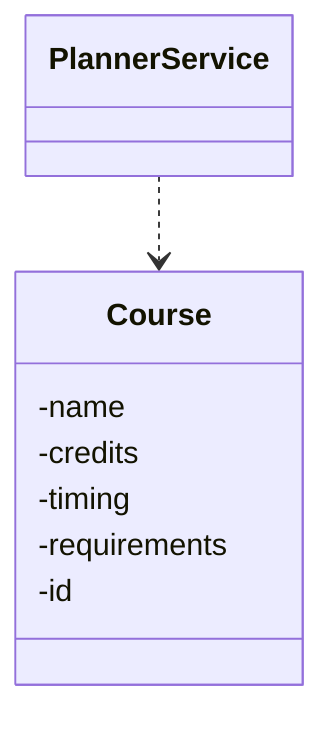
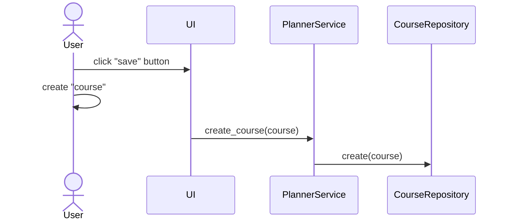

# Arkkitehtuuri

## Sovelluslogiikka

Sovelluksen ainoa oma tietorakenne on `Course`-luokka, joka kuvaa kurssia.

## Algoritmi

Sovelluksen toiminta perustuu suunnatun verkon topologiseen järjestykseen [^tirakirja].
Lisäksi oletetaan, että jos samalla periodilla on tarjolla kurssi ja sen esitietokurssi, niin ne voidaan suorittaa rinnakkain.

Algoritmin vaiheet:

1. Muodostetaan kursseista lista topologisessa järjestyksessä [graphlib](https://docs.python.org/3/library/graphlib.html)-kirjaston avulla.
2. Käydään käyttäjän syöttämän aloitusvuodesta alkaen periodit läpi.
3. Lisätään kurssilistan alusta alkaen periodille kelpaavat kurssit ja muistetaan mihin jäätiin.
   1. Tähän vaiheeseen voi lisätä periodikohtaiset opintopisterajat.
4. Toistetaan kunnes kurssilista on käyty läpi.

[^tirakirja]: Antti Laaksonen, *Tietorakenteet ja algoritmit*, 2022. https://www.cs.helsinki.fi/u/ahslaaks/tirakirja/

## Toiminnallisuudet

### Kurssin tallentaminen

### Aikataulun laskeminen
