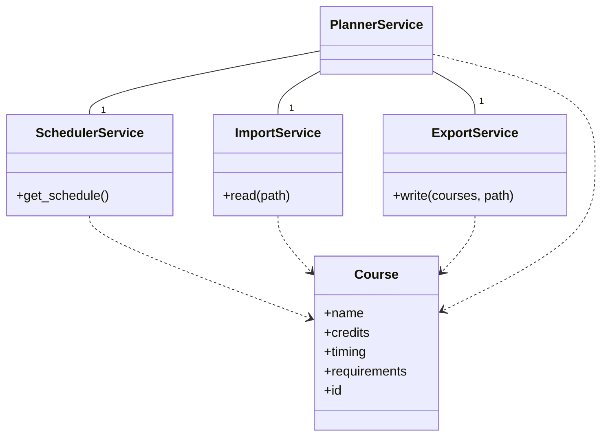
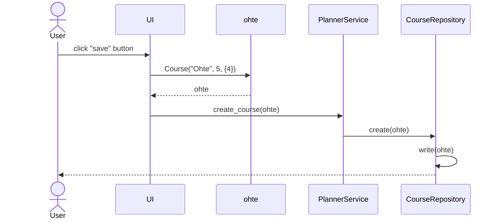
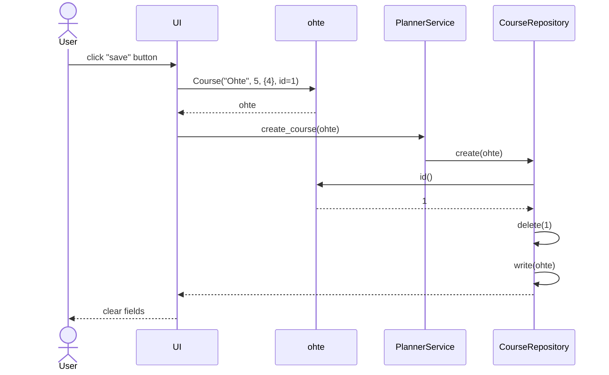
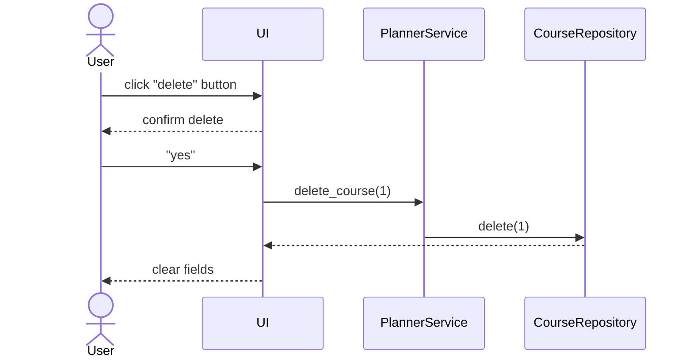
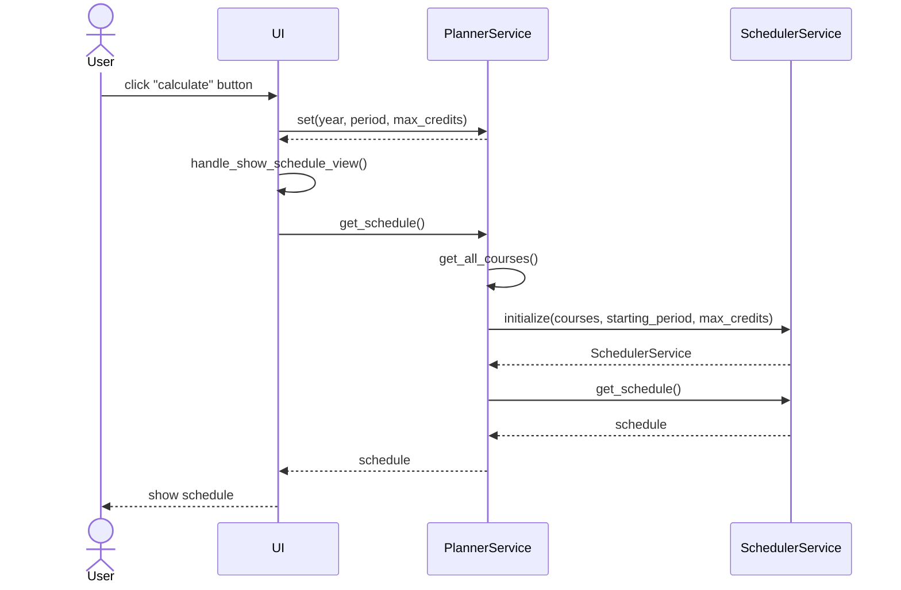
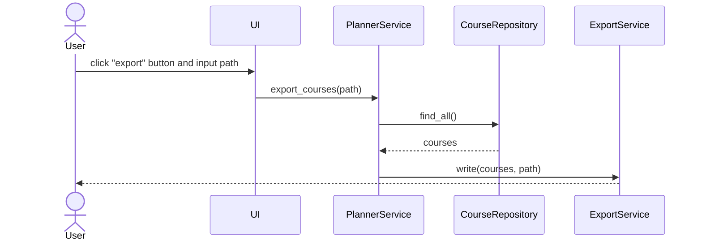
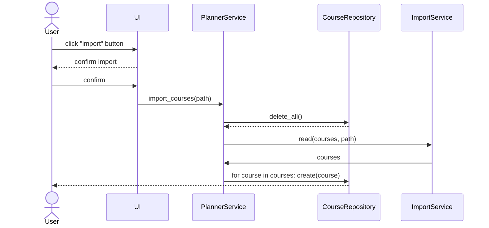

# Arkkitehtuuri

## Sovelluslogiikka

Sovelluksen ainoa oma tietorakenne on `Course`-luokka, joka kuvaa kurssia.
Sovelluksen logiikasta vastaa `PlannerService`-luokka.
`PlannerService` käyttää sisäisesti luokkia `SchedulerService`, `ImportService` ja `ExportService` aikataulun tuottamiseen, kurssitietojen lukemiseen JSON-tiedostosta ja kurssitietojen kirjoittamiseen JSON-tiedostoon.
Edellä mainitut luokat injektoidaan `PlannerService`-luokalle konstruktorikutsussa.

### Luokkakaavio

Luokkien riippuvuudet on esitetty seuraavassa luokkakaaviossa.



### Pakkausrakenne

Sovelluksen koodit on jaettu pääosin viiteen osaan

- `entities`, tietorakenteet
  - `Course`
- `repositories`, tietorakenteiden pysyväistallennus [repository](https://learn.microsoft.com/en-us/dotnet/architecture/microservices/microservice-ddd-cqrs-patterns/infrastructure-persistence-layer-design)-mallin mukaan
  - `CourseRepository`
- `services`, sovelluslogiikka ja toiminnallisuudet
  - `ExportService`
  - `ImportService`
  - `PlannerService`
  - `SchedulerService`
- `ui`, käyttöliittymä
- `lib`, sekalaista

## Aikataulutusalgoritmi

Sovelluksen toiminta perustuu suunnatun verkon topologiseen järjestykseen, syvyyshakuun ja Kahnin algoritmiin [^tirakirja] [^kahn].

Algoritmin toiminnasta vastaa `SchedulerService`-luokka.
Ennen algoritmin suorittamista muunnetaan kurssien riippuvuudet verkoksi.
Samalla tarkistetaan, että verkossa ei ole syklejä (syvyyshaulla) ja että verkko ei ole tyhjä.

Algoritmi tarvitsee Kahnin algoritmin tavoin tiedon jokaisen solmusta ulospäin menevistä kaarista sekä jokaisen solmulle tulevien kaarien määrän (in-degree).
Kuitenkin Kahnin algoritmista poiketen algoritmi ylläpitää jokaiselle periodille kelpaavista kursseista minimikekoa opintopisteiden perusteella.

Minimikeko on opintopisterajoitusta varten.
Jos kurssi, jolla on pienin opintopistemäärä, ei mahdu periodille, niin ei muutkaan mahdu.
Tästä seuraa myös, että algoritmi täyttää aikataulun ensisijaisesti kursseilla, joiden opintopistemäärä on pienin.

Aina kun kurssi lisätään aikatauluun, niin sen naapureiden in-degree pienenee yhdellä.
Jos naapurin in-degree laskee nollaan eli esitiedot täyttyvät, niin se lisätään kekoihin.
Koska sama kurssi voi olla usealla periodilla tarjolla, niin pidetään myös kirjaa jo käsitellyistä kursseista.
Periodien määrän voidaan olettaa vakioksi (4 tai 6, riippuen onko kesäperiodit mukana), joten ei aikavaativuus kasva.

Algoritmin pseudokoodi:

```python
remaining_credits = max_credits
i = 0
processed = set()

while queues_not_empty():
    # Laskee periodin jakojäännöksen perusteella
    period = get_period(i) 
    heap = heaps[period]
    
    if queue.empty():
        i += 1
        remaining_credits = _max_credits
    
    course = heap.pop()

    if course.id in processed:
        continue

    if course.credits > remaining_credits:
        i += 1
        remaining_credits = max_credits
        heap.push(course)
        continue

    # Päivitetään naapureiden tilat
    for neighbor in get_neighbors(course):
        in_degree[neighbor] -= 1

        if in_degree[neighbor] == 0:
            for period in neighbor.timing:
                heap = heaps[period]

                heap.push(neighbor)

    schedule[i].add(course)
    processed.add(course.id)
    remaining_credits -= course.credits
```

## Tietojen tallennus

Sovellus tallentaa pysyvästi kurssien tiedot (nimi, opintopisteet, ajoitus, esitiedot) SQL-tietokantaan.
Tallennuksesta vastaa `CourseRepository`-luokka.
Lisäksi sovellus voi lukea JSON-tiedostosta kurssitiedot tietokantaan.
Koska kurssien määrä on pieni (suuruusluokkaa $10^1$ tai $10^2$), niin `PlannerService` hakee aina kurssien tiedot `CourseRepository`-luokan kautta eikä ylläpidä välimuistia.

Sovellus voi myös kirjoittaa JSON-tiedostoon kurssitiedot helpottaakseen kurssitietojen jakamista.
JSON-tiedoston lukemisesta ja kirjoittamisesta vastaavat `ImportService`- ja `ExportService`-luokka.

## Toiminnallisuudet

Kaavioista on jätetty pois joitakin sisäisiä metodikutsuja `PlannerService`-luokasta, koska ne tekevät vain tarkistuksia ja toimivat rajapintoina muihin luokkiin.

### Uuden kurssin tallentaminen

Oletetaan, että käyttäjä syöttää uuden kurssin "Ohte" tiedot.
Kun käyttäjä painaa Tallenna-nappia:



### Olemassaolevan kurssin muokkaaminen

Oletetaan, että käyttäjä valitsee valikosta olemassaolevan kurssin "Ohte" (id=1) ja päivittää tietoja.
Koska kurssit on tallennettu tietokantaan useana tauluna, niin yksinkertaisuuden vuoksi ne poistetaan ennen päivittämistä.

Kun käyttäjä painaa Tallenna-nappia:



### Olemassaolevan kurssin poistaminen

Oletetaan, että käyttäjä valitsee valikosta olemassaolevan kurssin "Ohte" (id=1).
Kun käyttäjä painaa Poista-nappia:



### Aikataulun laskeminen

Oletetaan, että käyttäjä on tallentanut jotain kursseja ja syöttänyt parametrit aikataulua varten.
Kun käyttäjä painaa Laske-nappia:



### Kurssitietojen vieminen JSON-tiedostoon

Oletetaan, että käyttäjä on tallentanut jotain kursseja.
Kun käyttäjä painaa Vie-nappia:



### Kurssitietojen lukeminen JSON-tiedostosta

Oletetaan, että käyttäjällä on oikeanmuotoinen JSON-tiedosto kurssitiedoista.
Koska kurssitietojen lukeminen voi sotkea kurssien riippuvuudet, niin jo olevat kurssitiedot poistetaan ennen kurssien lukemista.

Kun käyttäjä painaa Tuo-nappia:



## Puutteet

- Sovellus ei osaa käsitellä kursseja, jotka kestävät useita periodeja.
  - Workaround: Merkkaa kurssin ajoituksiin ne periodit, joihin ne päättyvät.
- Sovellus ei pysty merkkaamaan kursseja suoritetuksi.
  - Workaround: Merkkaa kurssin laajuudeksi 0 op ja ajoitukseksi mikä tahansa periodi, tällöin kurssi laitetaan alkuun.

[^tirakirja]: Antti Laaksonen, *Tietorakenteet ja algoritmit*, 2022. https://www.cs.helsinki.fi/u/ahslaaks/tirakirja/
[^kahn]: Geeksforgeeks, *Kahn’s algorithm for Topological Sorting*. https://www.geeksforgeeks.org/topological-sorting-indegree-based-solution/, luettu 28.4.2023.
