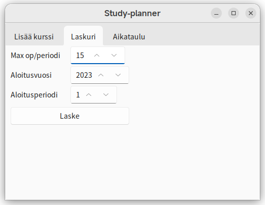

# Käyttöohje

## Asennus

1. Asenna Python `3.10.x` ja [Poetry](https://python-poetry.org/).
2. Klonaa repositorio.
3. Asenna riippuvuudet:

    ```shell
    poetry install
    ```

## Käynnistys

Sovellus käynnistyy komennolla:

```shell
poetry run invoke start
```

## Kurssin luominen

Täytä tiedot ja paina "Tallenna"-nappia.


### Kurssien vienti

Kurssitiedot voidaan tallentaa JSON-tiedostoksi painamalla "Vie"-nappia ja antamalla haluttu tiedostonimi.

### Kurssien tuonti

Kurssitiedot voidaan lukea JSON-tiedostosta painamalla "Tuo"-nappia ja valitsemalla tiedosto.

## Laskuri

Kun kurssit on lisätty, niin painamalla laskurivälilehteä pääsee laskurinäkymään.
Kun halutut parametrit on syötetty, niin "Laske"-nappia painamalla pääsee aikataulunäkymään.



## Aikataulu

Aikataulunäkymässä on kurssit jaettu sopiviin vuosiin ja periodeihin laskurinäkymässä annettujen tietojen perusteella.


