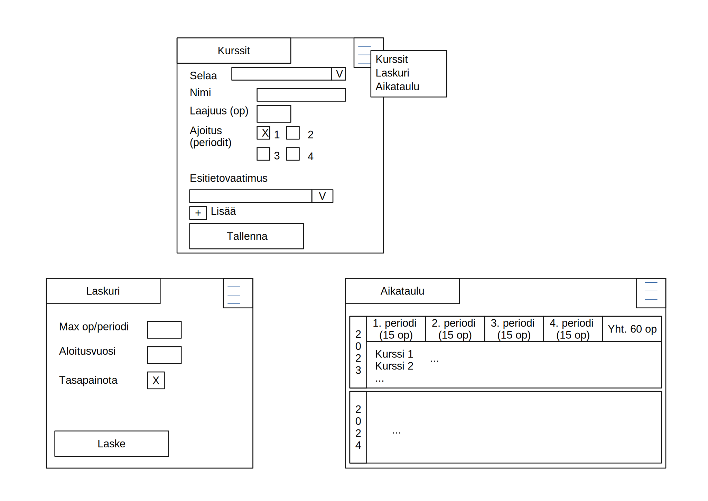

# Vaatimusmäärittely

## Sovelluksen tarkoitus

Sovellus tuottaa aikataulun opinnoille annettujen vaatimusten (opintopisteraja/periodi, opintojen kesto) perusteella.

## Käyttöliittymäluonnos



Sovellus aukeaa kurssien lisäysnäkymään ja välilehtiä klikkaamalla voi vaihtaa näkymiä.
Aikataulunäkymä on korvattu puulla:

```txt
2023 (30 op)
    1. periodi (15 op)
        Kurssi 1
        Kurssi 2
        ...
    2. periodi (15 op)
        ...
2024 (60 op)
    ...
...
```

## Toiminnallisuudet

### Perustoiminnallisuudet

### Kurssitietojen käsittely

- [x] Kurssien lisäys, muokkaus ja poisto
- [x] Syötettyjen kurssitietojen tyhjentäminen
- [x] Kurssitietojen säilyttäminen tietokannassa
- [x] Kurssitietojen lukeminen `json`-tiedostosta
- [x] Kurssitietojen kirjoittaminen `json`-tiedostoon

### Aikataulutus

- [x] Aikataulun tuottaminen
- [x] Esitiedovaatimukset huomioitu
- [x] Mahdollisimman vähän tyhjää
- [x] Periodikohtainen opintopisteyläraja
- [x] Aloitusvuosi ja -periodi
- [x] Konfiguroitava periodimäärä

### Jatkokehitysideoita

- [ ] Aikataulun vieminen `json`-tiedostona
- [ ] Kurssien haku verkosta (jos löytyy API, todennäköisesti ei toteudu)
