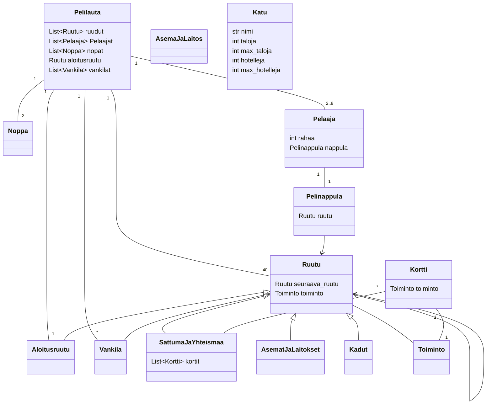

# Tehtävä 2

Laajennettu luokkakaavio Monopoli-pelille.

```mermaid
classDiagram
    Pelilauta "1" -- "2" Noppa
    Pelilauta "1" -- "2..8" Pelaaja
    Pelilauta "1" -- "40" Ruutu
    Pelilauta "1" -- "1" Aloitusruutu
    Pelilauta "1" -- "*" Vankila

    Ruutu <|-- Aloitusruutu
    Ruutu <|-- Vankila
    Ruutu <|-- SattumaJaYhteismaa
    Ruutu <|-- AsematJaLaitokset
    Ruutu <|-- Kadut
    Ruutu -- Toiminto
    Ruutu --> Ruutu

    Kortti "*" -- "1" SattumaJaYhteismaa
    Kortti "1" -- "1" Toiminto

    Pelaaja "1" -- "1" Pelinappula
    Pelinappula --> Ruutu

    class Pelilauta {
        List~Ruutu~ ruudut
        List~Pelaaja~ Pelaajat
        List~Noppa~ nopat
        Ruutu aloitusruutu
        List~Vankila~ vankilat
    }
    class Pelaaja {
        int rahaa
        Pelinappula nappula
    }
    class Pelinappula {
        Ruutu ruutu
    }
    class Ruutu {
        Ruutu seuraava_ruutu
        Toiminto toiminto
    }
    class Aloitusruutu
    class Vankila
    class SattumaJaYhteismaa {
        List~Kortti~ kortit
    }
    class AsemaJaLaitos
    class Katu {
        str nimi
        int taloja
        int max_taloja
        int hotelleja
        int max_hotelleja
    }
    class Toiminto
    class Kortti {
        Toiminto toiminto
    }
```
