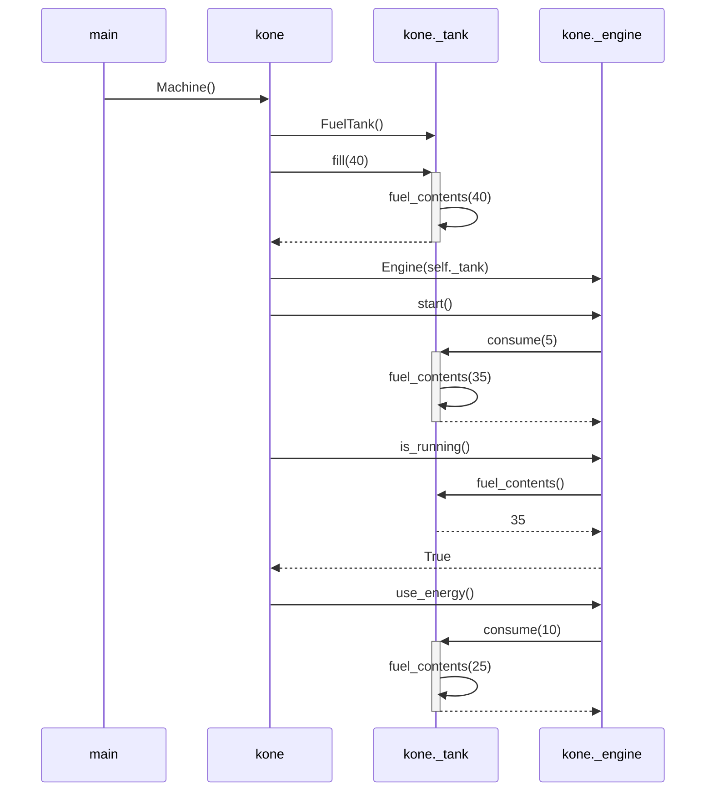

# Tehtävä 3

Olkoon tilanne

```python
def main:
    kone = Machine()
    kone.drive()

main()
```


```mermaid
    sequenceDiagram
    main ->> kone: Machine()
    kone ->> kone._tank: FuelTank()
    kone ->>+ kone._tank: fill(40)
    kone._tank ->> kone._tank: fuel_contents(40)
    kone._tank -->>- kone: 
    kone ->> kone._engine: Engine(self._tank)
    kone ->> kone._engine: start()
    kone._engine ->>+ kone._tank: consume(5)
    kone._tank ->> kone._tank: fuel_contents(35)
    kone._tank -->>- kone._engine: 
    kone ->> kone._engine: is_running()
    kone._engine ->> kone._tank: fuel_contents()
    kone._tank -->> kone._engine: 35
    kone._engine -->> kone: True
    kone ->> kone._engine: use_energy()
    kone._engine ->>+ kone._tank: consume(10)
    kone._tank ->> kone._tank: fuel_contents(25)
    kone._tank -->>- kone._engine: 
```
