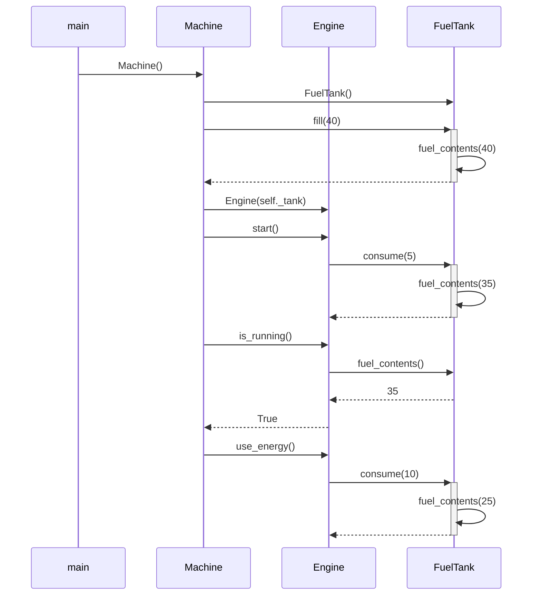

# Tehtävä 3

Olkoon tilanne

```python
def main:
    machine = Machine()
    machine.drive()

main()
```


```mermaid
    sequenceDiagram
    participant main
    participant Machine
    participant Engine
    participant FuelTank

    main ->> Machine: Machine()
    Machine ->> FuelTank: FuelTank()
    Machine ->>+ FuelTank: fill(40)
    FuelTank ->> FuelTank: fuel_contents(40)
    FuelTank -->>- Machine: 
    Machine ->> Engine: Engine(self._tank)
    Machine ->> Engine: start()
    Engine ->>+ FuelTank: consume(5)
    FuelTank ->> FuelTank: fuel_contents(35)
    FuelTank -->>- Engine: 
    Machine ->> Engine: is_running()
    Engine ->> FuelTank: fuel_contents()
    FuelTank -->> Engine: 35
    Engine -->> Machine: True
    Machine ->> Engine: use_energy()
    Engine ->>+ FuelTank: consume(10)
    FuelTank ->> FuelTank: fuel_contents(25)
    FuelTank -->>- Engine: 
```
